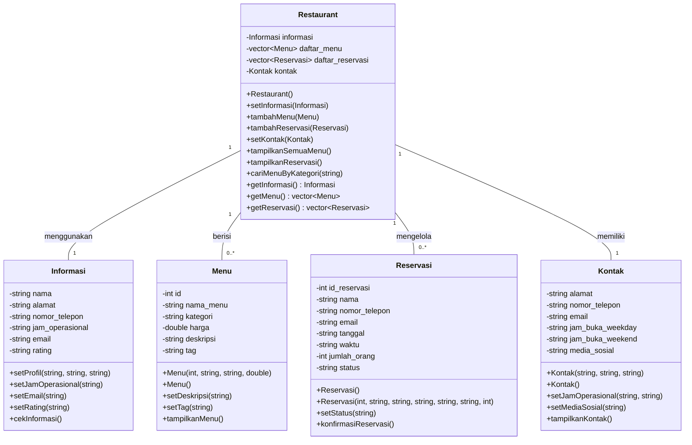

# UML Diagram - Ale's Place Cipoho Restaurant System

## Class Diagram

## Penjelasan Hubungan Class:

### 1. **Informasi**
   - Menyimpan data utama restoran (nama, alamat, telepon, email, jam operasional, rating)
   - Digunakan oleh class `Restaurant` untuk informasi umum

### 2. **Menu**
   - Menyimpan data setiap menu yang ditawarkan (id, nama, kategori, harga, deskripsi, tag)
   - Satu `Restaurant` dapat memiliki banyak `Menu` (relasi 1:banyak)
   - Tag digunakan untuk kategori (popular, new, promo)

### 3. **Reservasi**
   - Menyimpan data pemesanan meja (nama, telepon, email, tanggal, waktu, jumlah orang, status)
   - Satu `Restaurant` dapat mengelola banyak `Reservasi` (relasi 1:banyak)
   - Status: Pending, Confirmed, Completed, Cancelled

### 4. **Kontak**
   - Menyimpan informasi kontak restoran (alamat, telepon, email, jam buka)
   - Jam buka dibedakan untuk weekday (Senin-Jumat) dan weekend (Sabtu-Minggu)
   - Termasuk media sosial

### 5. **Restaurant** (Main Class)
   - Class utama yang mengintegrasikan semua komponen
   - Mengelola informasi, menu, reservasi, dan kontak
   - Menyediakan method untuk:
     - Menambah menu
     - Menambah reservasi
     - Mencari menu berdasarkan kategori
     - Menampilkan semua menu dan reservasi

## Fitur-Fitur Sistem:

✅ **Manajemen Menu:**
- Tambah menu baru
- Cari menu berdasarkan kategori (Ramen, Appetizer, Dessert, Minuman)
- Tampilkan semua menu dengan detail

✅ **Sistem Reservasi:**
- Buat reservasi baru dengan data pelanggan
- Tracking status reservasi
- Konfirmasi detail reservasi

✅ **Informasi Restoran:**
- Kelola data profil restoran
- Update jam operasional
- Manajemen rating dan email

✅ **Manajemen Kontak:**
- Informasi alamat dan telepon
- Jam buka weekday & weekend
- Link media sosial
